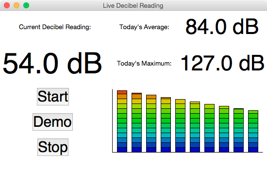

# decibel-reader

This repository contains Python code which reads decibel levels from
a connected USB sound level meter, displays them graphically, and saves
each reading and its timestamp to disk as a JSON file. The goal is to use
this code to measure decibels in an indoor athletic arena and send
measurements to an FTP server where they can be located and displayed as
a live stat in the team's official app and on the team's official web site.

The current iteration of the decibel reader widget looks like this:

The longer-term goal is to use the data from this reader to trigger some sort
of alert (perhaps a push notification in the app) when the sound level in the
arena exceeds some as-yet-undetermined threshold, or remains above some
threshold for some as-yet-undetermined length of time, so that fans would know
that the game's getting exciting, or so that highlight moments might be chosen
automatically. It's still unclear how this might be accomplished.

## Hardware

This script was written for a **Wensn WS1361 Digital Sound Level Meter**
with a range of 30 to 130 dB.

## Notes

This script is run during games on a Windows XP netbook, so care has been
taken to ensure that it uses only code present in the standard library in
Python 2.7.9.
